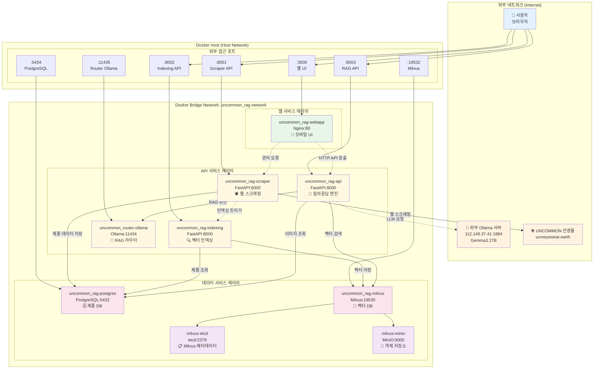
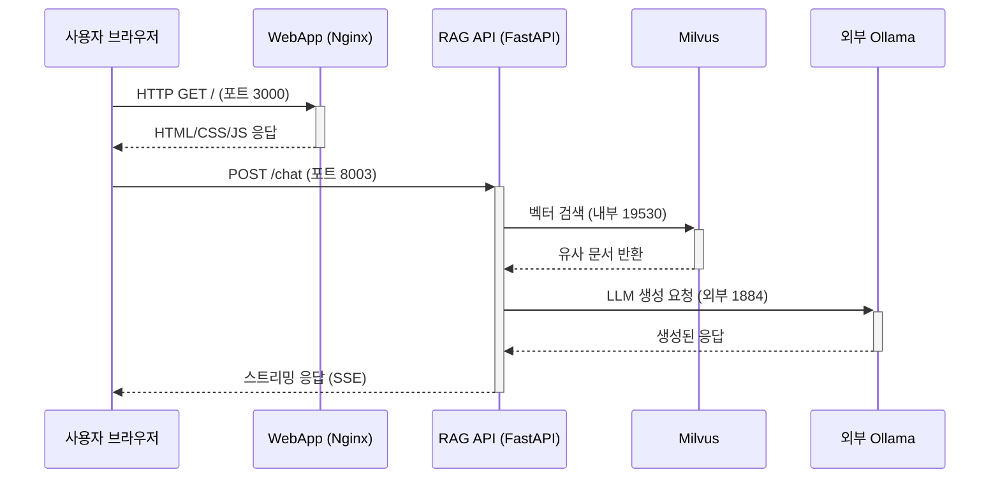
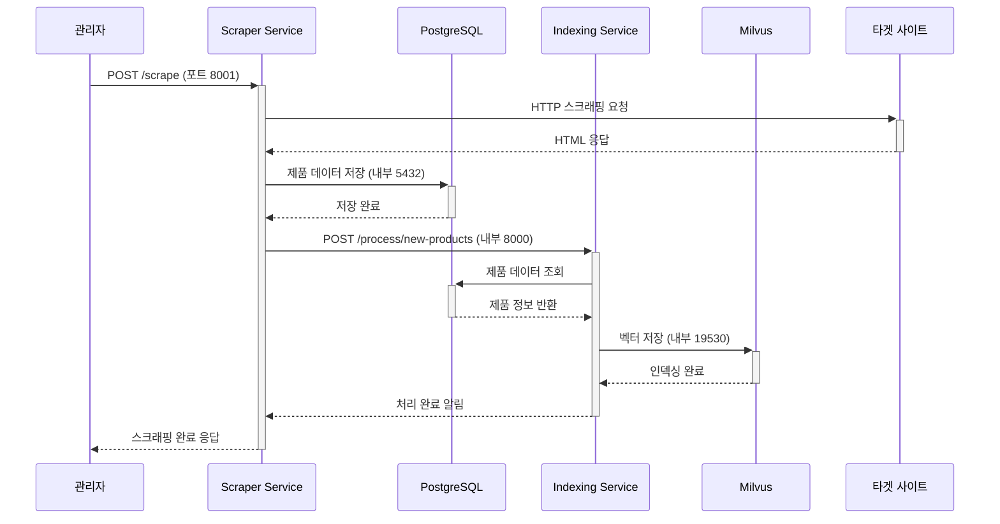
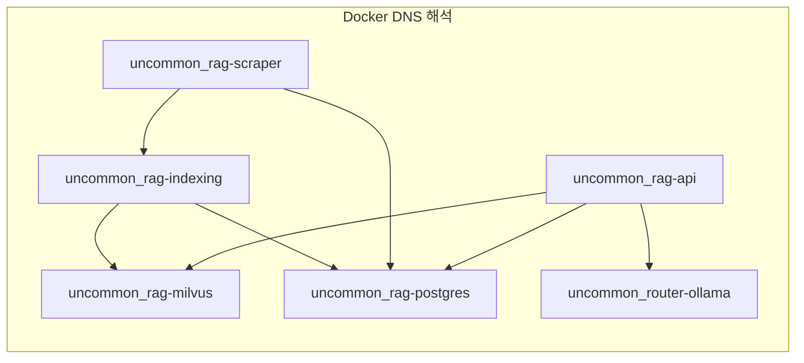
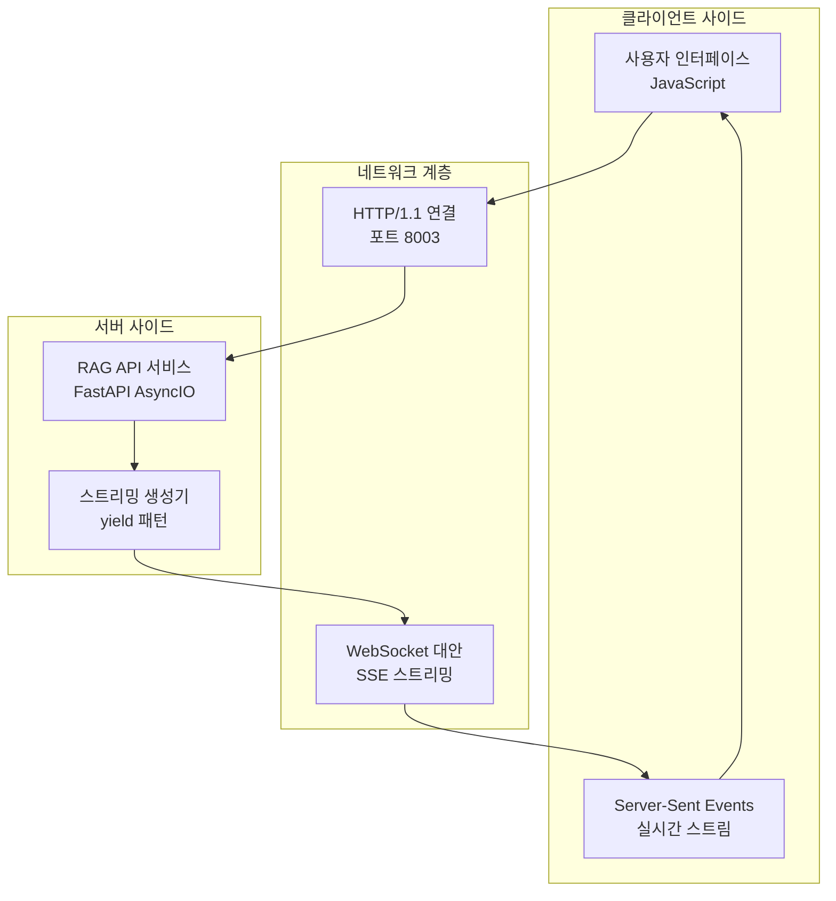
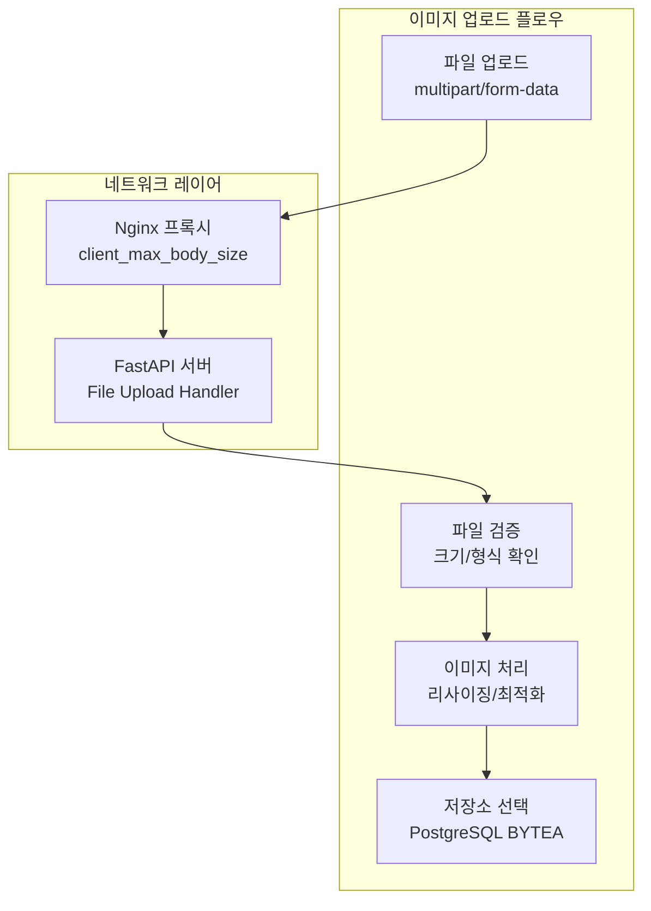
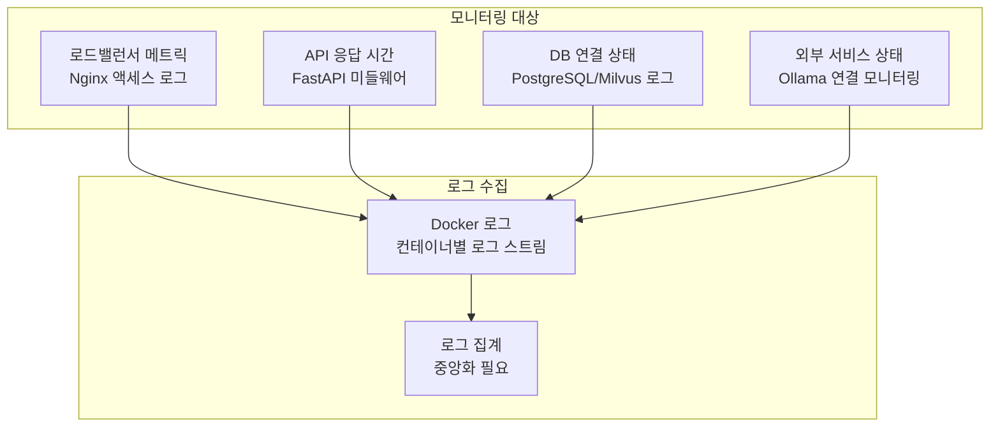
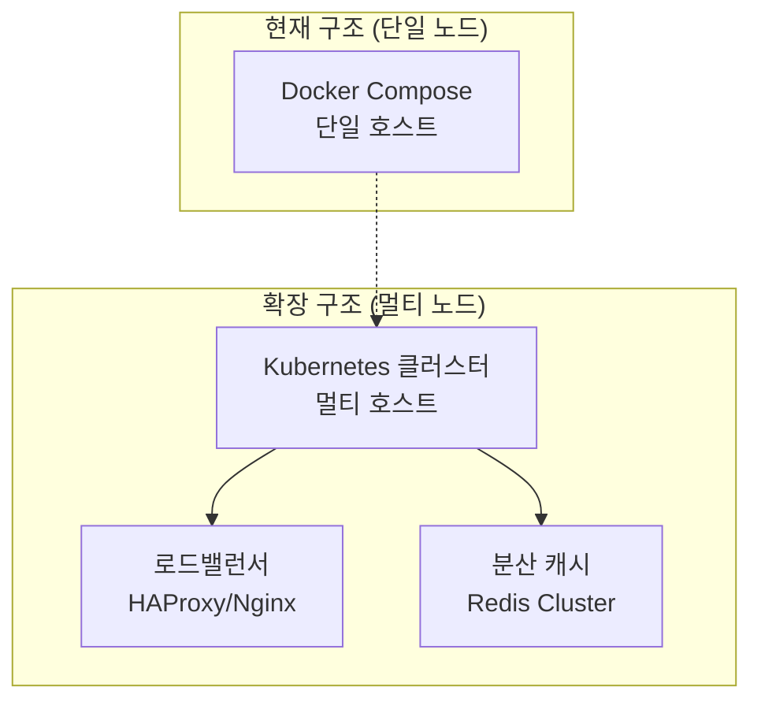

# UNCOMMON RAG LLM 시스템 네트워크 다이어그램

## 네트워크 토폴로지 개요

시스템은 Docker 브릿지 네트워크 `uncommon_rag-network`를 기반으로 구성되며, 외부 접근 포트와 내부 통신 포트를 분리하여 보안성과 확장성을 확보했습니다.

## 전체 네트워크 아키텍처



## 네트워크 설정 세부사항

### Docker 네트워크 구성
```yaml
networks:
  uncommon_rag-network:
    driver: bridge
    name: uncommon_rag-network
```

### 포트 매핑 전략

| 서비스 | 외부 포트 | 내부 포트 | 프로토콜 | 목적 |
|--------|----------|----------|----------|------|
| 웹 앱 | 3000 | 80 | HTTP | 사용자 인터페이스 |
| Scraper API | 8001 | 8000 | HTTP | 스크래핑 관리 |
| Indexing API | 8002 | 8000 | HTTP | 벡터 인덱싱 |
| RAG API | 8003 | 8000 | HTTP | 질의응답 서비스 |
| PostgreSQL | 5434 | 5432 | TCP | 데이터베이스 접근 |
| Milvus | 19532 | 19530 | gRPC | 벡터 검색 |
| Router Ollama | 11435 | 11434 | HTTP | 내부 LLM |

## 서비스 간 통신 패턴

### 1. 사용자 요청 플로우


### 2. 스크래핑 및 인덱싱 플로우


## 네트워크 보안 및 격리

### 현재 보안 설정 (MVP 단계)
- **네트워크 격리**: Docker 브릿지 네트워크로 서비스 간 격리
- **포트 노출**: 필요한 서비스만 외부 포트 매핑
- **내부 통신**: 컨테이너 이름 기반 DNS 해석

### 내부 서비스 통신 (컨테이너 간)


## 데이터 플로우 네트워크 다이어그램

### 실시간 채팅 데이터 플로우


### 이미지 업로드 네트워크 플로우


## 네트워크 성능 최적화

### 1. 커넥션 풀링
```yaml
# PostgreSQL 연결 풀 설정
DB_POOL_SIZE: 10
DB_MAX_OVERFLOW: 20
DB_POOL_TIMEOUT: 30
DB_POOL_RECYCLE: 3600
```

### 2. HTTP 연결 최적화
```yaml
# FastAPI/Uvicorn 설정
UVICORN_WORKERS: 4
UVICORN_KEEP_ALIVE: 5
UVICORN_TIMEOUT_KEEP_ALIVE: 5
```

### 3. 내부 서비스 검색 최적화
- **DNS 캐싱**: Docker 내장 DNS 활용
- **헬스체크**: 각 서비스별 `/health` 엔드포인트
- **로드밸런싱**: Nginx upstream 설정 준비

## 모니터링 및 로깅

### 네트워크 모니터링 포인트


## 확장성 및 고가용성

### 수평 확장 계획


### 백업 및 복구 네트워크
- **PostgreSQL**: 마스터-슬레이브 복제 설정
- **Milvus**: 분산 클러스터 구성
- **설정 백업**: Git 기반 형상 관리

## 트러블슈팅 가이드

### 네트워크 연결 문제 진단
```bash
# 1. 컨테이너 네트워크 상태 확인
docker network ls
docker network inspect uncommon_rag-network

# 2. 서비스 간 연결 테스트
docker exec uncommon_rag-api curl http://uncommon_rag-milvus:19530/health
docker exec uncommon_rag-api curl http://uncommon_rag-postgres:5432

# 3. 포트 리스닝 상태 확인
netstat -tlnp | grep -E "(3000|8001|8002|8003|5434|19532)"

# 4. DNS 해석 테스트
docker exec uncommon_rag-api nslookup uncommon_rag-milvus
```

### 일반적인 네트워크 이슈
1. **포트 충돌**: 다른 서비스와의 포트 충돌
2. **방화벽 설정**: 호스트 방화벽 정책
3. **DNS 해석 실패**: Docker 네트워크 설정 오류
4. **타임아웃**: 외부 서비스 연결 시간 초과

이 네트워크 다이어그램은 시스템의 모든 네트워크 연결과 데이터 플로우를 명확히 보여주며, 확장성과 트러블슈팅을 고려한 구조로 설계되었습니다.