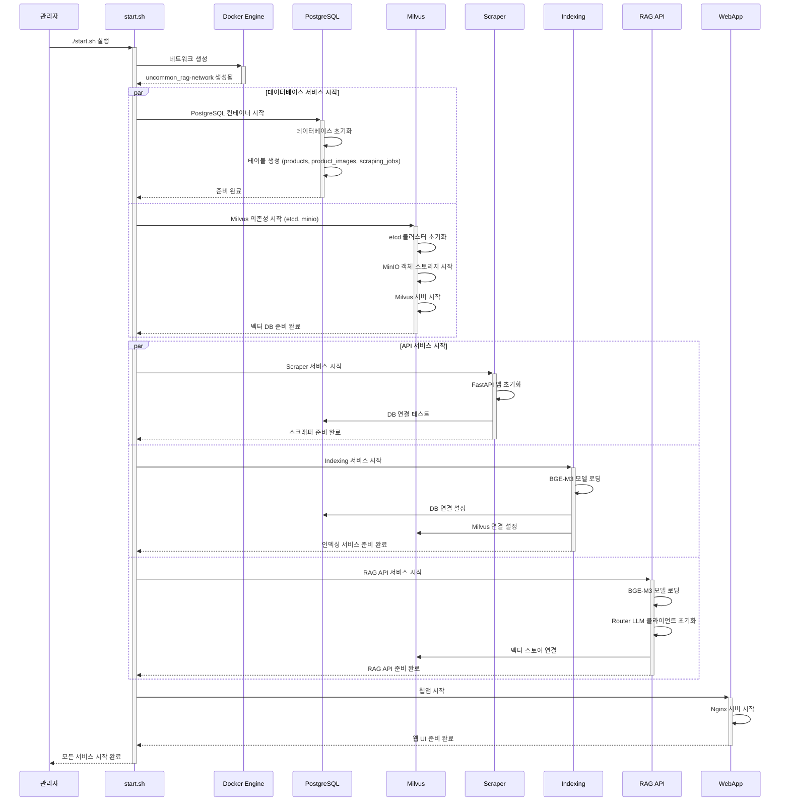
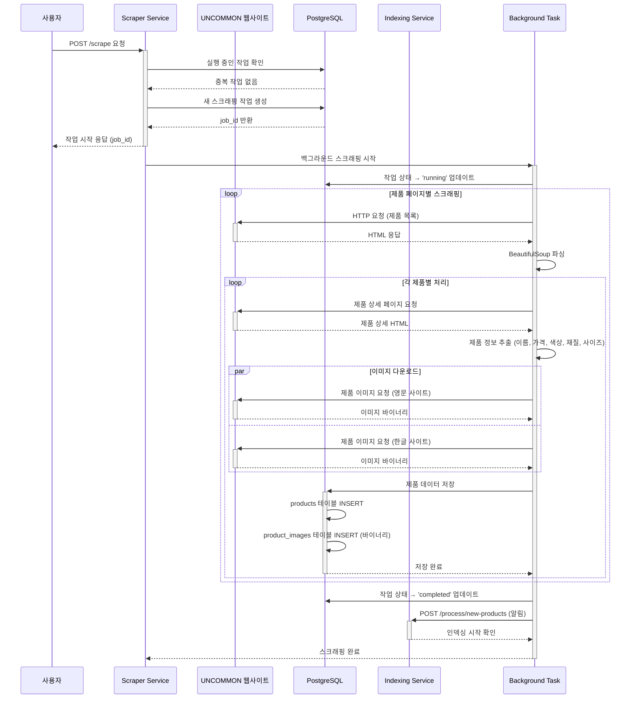
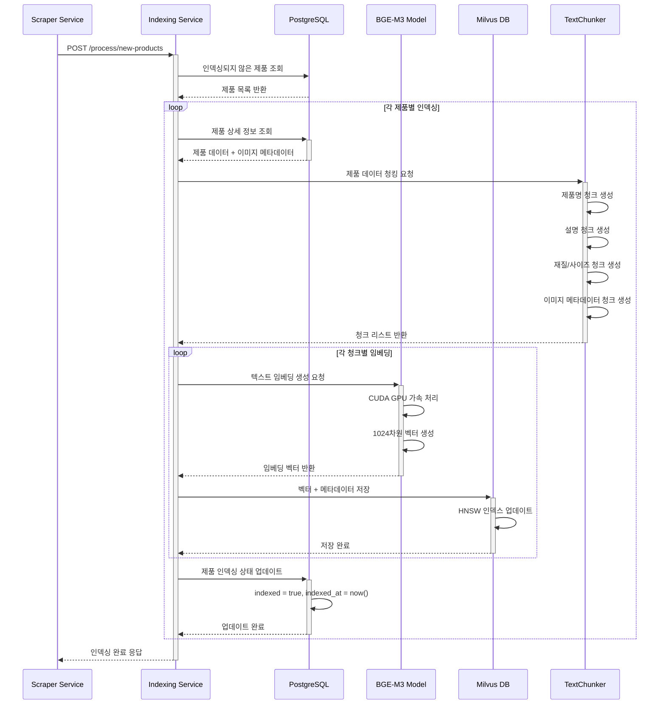
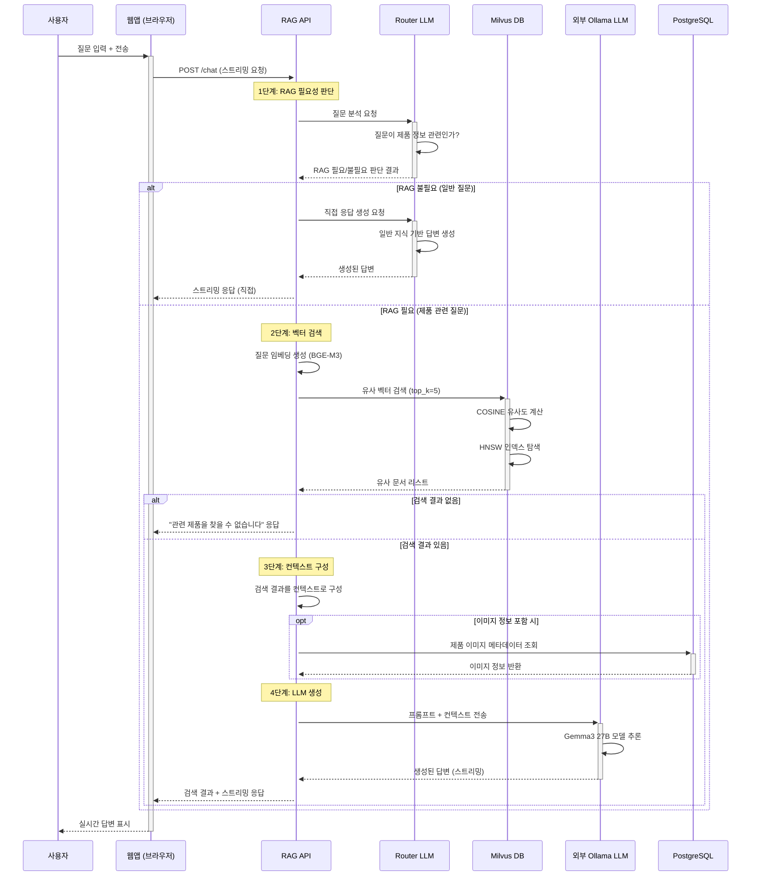
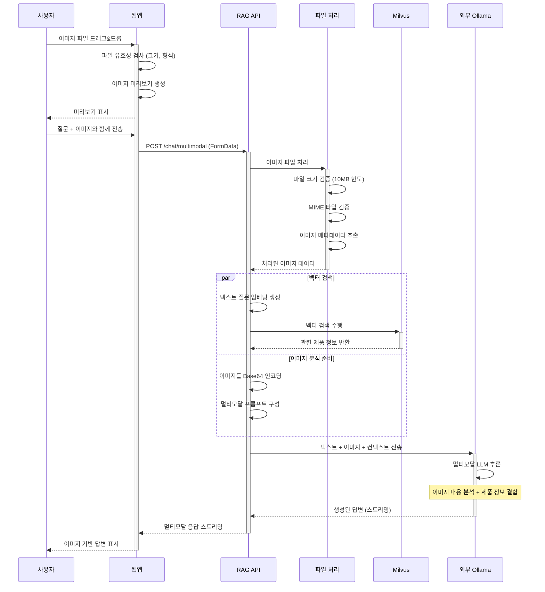
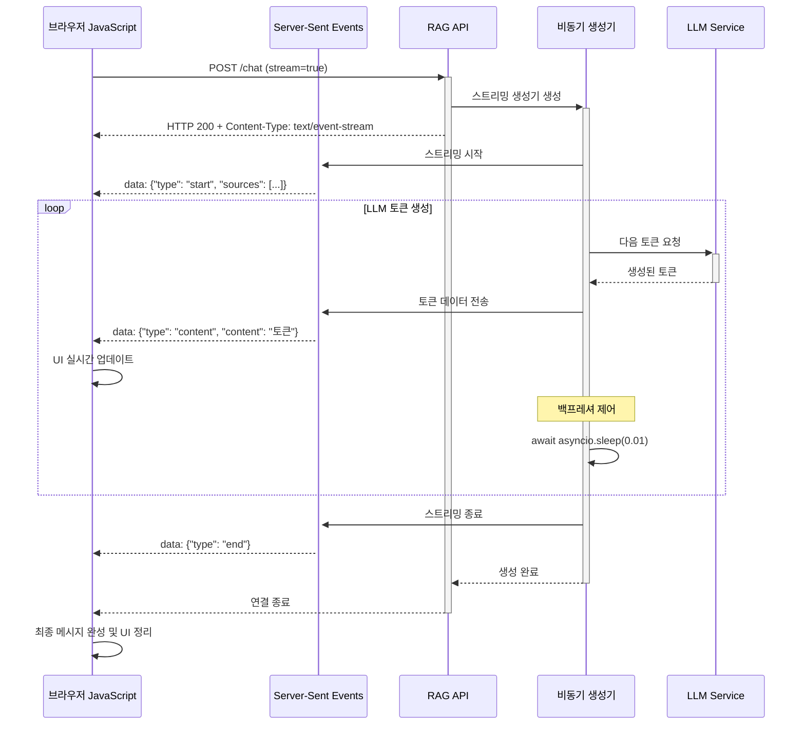
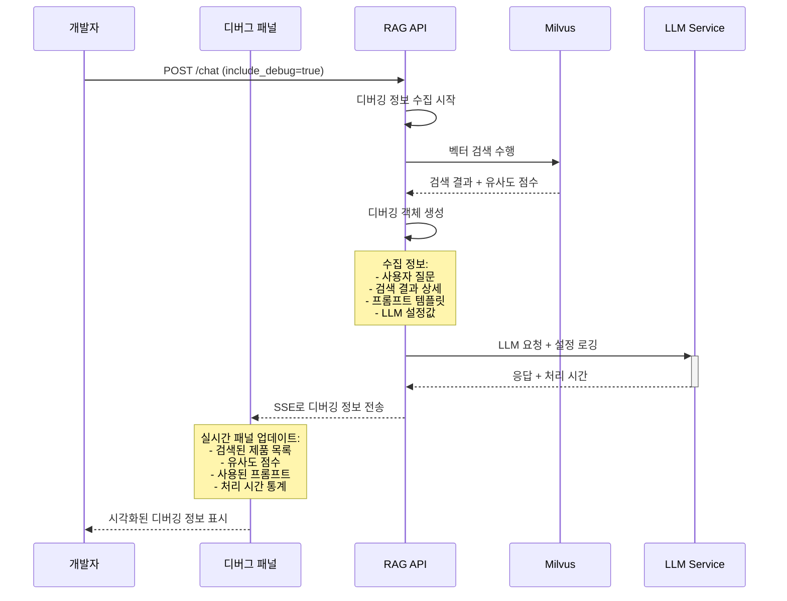
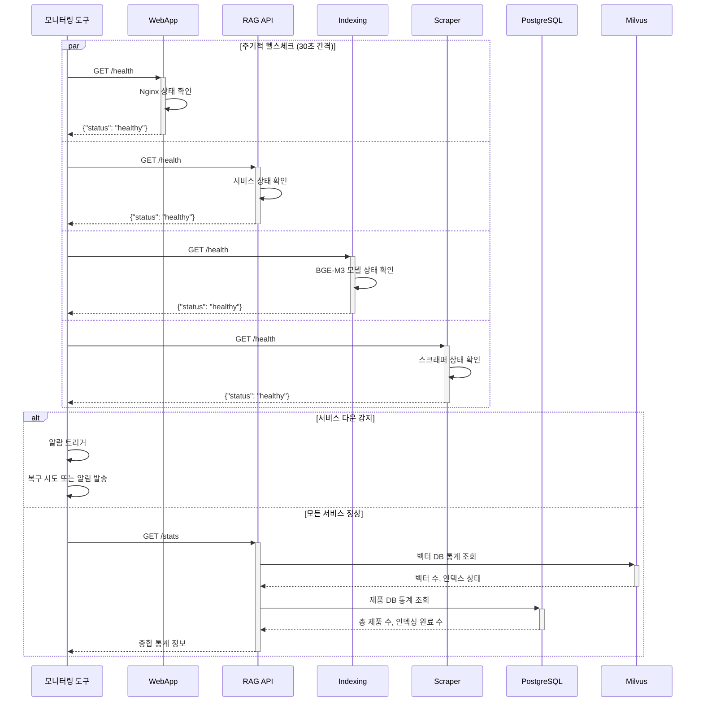
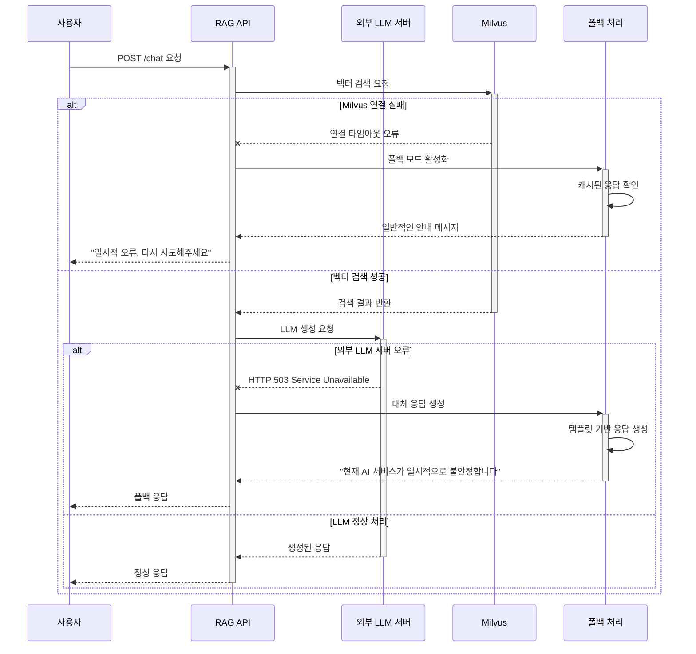
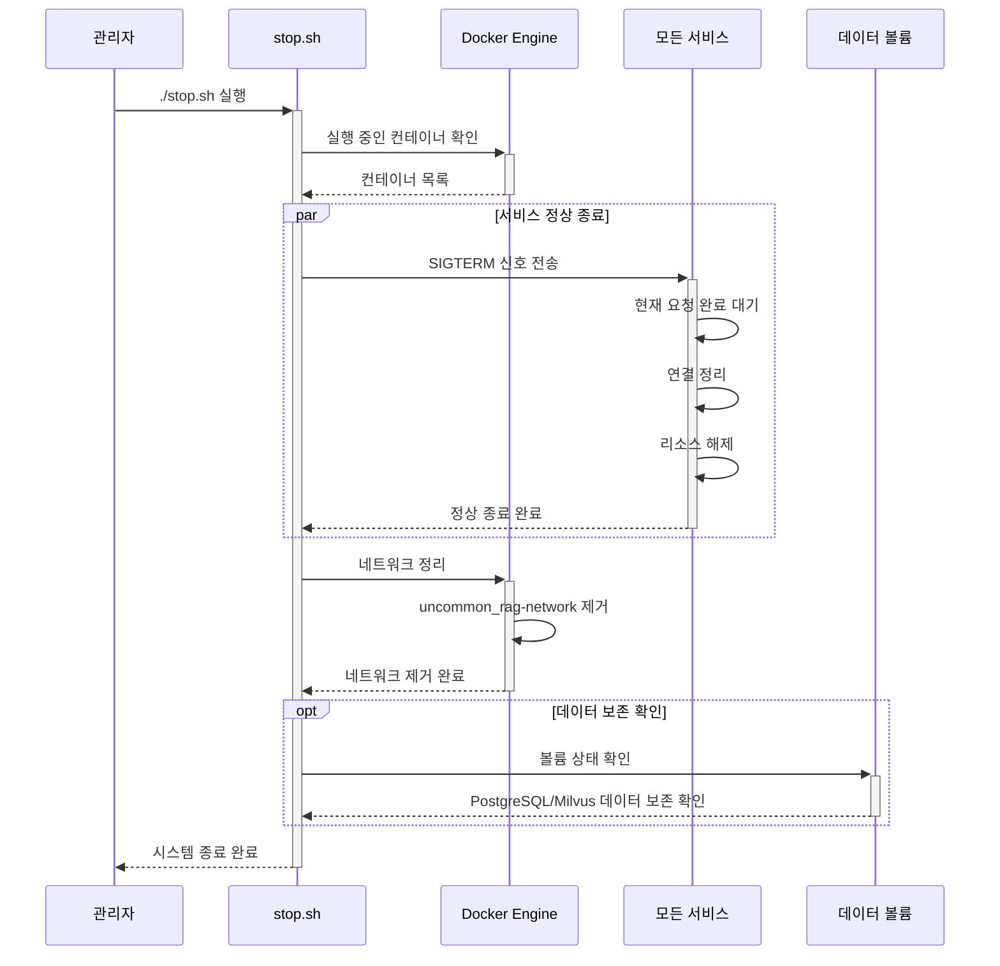

# UNCOMMON RAG LLM 시스템 시퀀스 다이어그램

## 개요
이 문서는 UNCOMMON RAG 시스템의 주요 워크플로우를 시간 순서에 따라 상세히 설명하는 시퀀스 다이어그램들을 포함합니다.

## 1. 전체 시스템 초기화 시퀀스

## 2. 제품 스크래핑 워크플로우

## 3. 벡터 인덱싱 워크플로우

## 4. 조건부 RAG 질의응답 워크플로우

## 5. 멀티모달 이미지 업로드 및 처리

## 6. 실시간 스트리밍 응답 처리

## 7. 디버깅 정보 수집 및 표시

## 8. 시스템 헬스체크 및 모니터링

## 9. 오류 처리 및 복구 시퀀스

## 10. 시스템 종료 시퀀스

이러한 시퀀스 다이어그램들은 시스템의 동작 방식을 시간 순서대로 명확히 보여주며, 각 구성 요소 간의 상호작용과 데이터 흐름을 이해하는 데 도움이 됩니다.