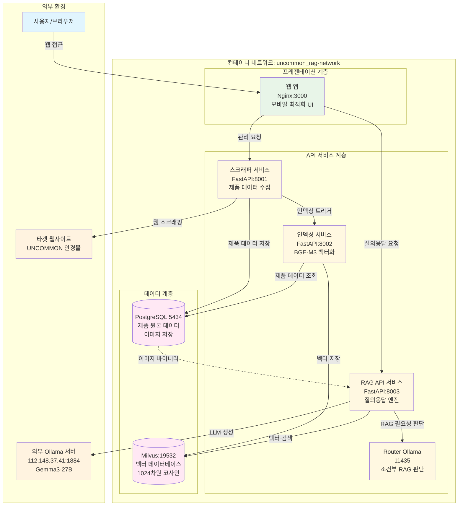
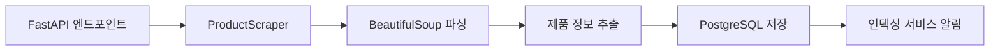
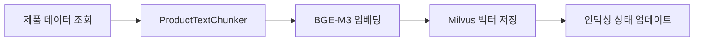
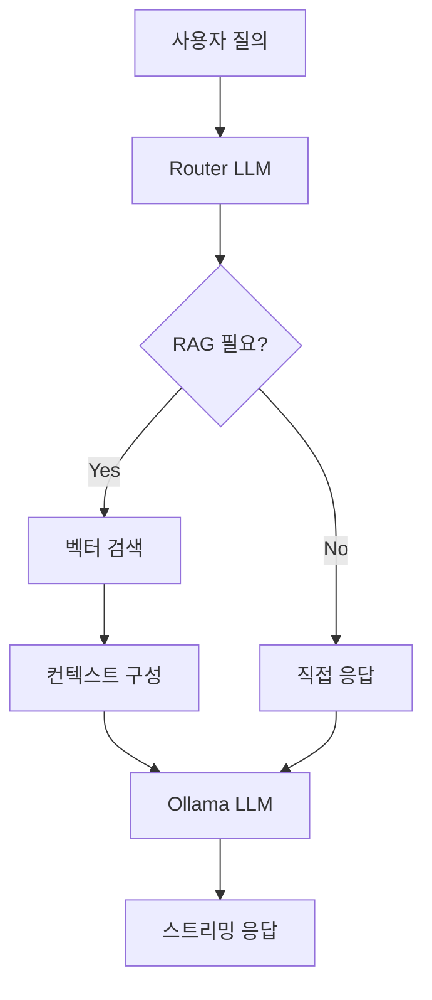
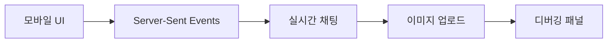

# UNCOMMON RAG LLM 시스템 아키텍처

## 개요
UNCOMMON 안경 제품 정보를 기반으로 한 지능형 질의응답 시스템으로, 웹 스크래핑, 벡터 인덱싱, RAG(Retrieval-Augmented Generation) 기술을 활용하여 실시간으로 정확한 제품 정보를 제공합니다.

## 전체 시스템 아키텍처



## 핵심 기술 스택

### 프론트엔드
- **웹 인터페이스**: Vanilla HTML5/CSS3/JavaScript
- **UI 프레임워크**: 모바일 우선 반응형 디자인
- **실시간 통신**: Server-Sent Events (SSE) 스트리밍
- **멀티모달**: HTML5 File API 이미지 업로드

### 백엔드 서비스
- **API 프레임워크**: FastAPI 0.104.1 (Python)
- **ASGI 서버**: Uvicorn
- **비동기 처리**: asyncio, aiohttp, httpx
- **데이터 검증**: Pydantic Models

### AI/ML 스택
- **임베딩 모델**: BGE-M3 (`BAAI/bge-m3`) - 1024차원
- **대화형 LLM**: Ollama Gemma3 27B IT Q4_K_M (외부 서버)
- **라우터 LLM**: Kanana Nano Abliterated (조건부 RAG)
- **벡터 검색**: 코사인 유사도, HNSW 인덱스

### 데이터베이스
- **관계형 DB**: PostgreSQL 16 (제품 원본 데이터, 이미지 저장)
- **벡터 DB**: Milvus 2.3.3 (임베딩 벡터 저장)
- **인덱스 타입**: HNSW (계층적 근사 근접 그래프)

### 인프라스트럭처
- **컨테이너화**: Docker & Docker Compose
- **웹 서버**: Nginx (정적 파일 서빙)
- **네트워크**: Docker 브릿지 네트워크
- **환경 관리**: 중앙집중식 .env.global

## 주요 구성 요소별 상세

### 1. 스크래퍼 서비스 (Scraper Service)


**핵심 기능:**
- UNCOMMON 안경몰 자동 스크래핑
- 제품명, 가격, 색상, 재질, 사이즈 정보 수집
- 이미지 바이너리 다운로드 및 저장
- 영문/한글 사이트 동시 처리
- 백그라운드 비동기 작업

**주요 API:**
- `POST /scrape` - 스크래핑 작업 시작
- `GET /health` - 서비스 상태 확인

### 2. 인덱싱 서비스 (Indexing Service)


**핵심 기능:**
- 제품 정보를 검색 최적화된 텍스트 청크로 분할
- BGE-M3 모델로 1024차원 벡터 생성
- Milvus 데이터베이스에 벡터 인덱싱
- CUDA GPU 가속 지원
- 자동/수동 인덱싱 모드

**주요 API:**
- `POST /index/products` - 제품 일괄 인덱싱
- `POST /index/products/{id}` - 단일 제품 인덱싱
- `GET /index/stats` - 인덱싱 통계

### 3. RAG API 서비스 (RAG API Service)


**핵심 기능:**
- 조건부 RAG (Conditional RAG) - 질의 내용에 따라 RAG 사용 여부 자동 판단
- 실시간 스트리밍 응답 (Server-Sent Events)
- 멀티모달 지원 (텍스트 + 이미지)
- 디버깅 모드 - 검색 결과, 프롬프트, 설정 정보 제공
- CORS 지원 크로스 도메인 요청

**주요 API:**
- `POST /chat` - 메인 질의응답 (스트리밍)
- `POST /chat/multimodal` - 멀티모달 질의응답
- `POST /search` - 벡터 검색만 수행
- `GET /stats` - 시스템 통계

### 4. 웹 애플리케이션 (Web Application)


**핵심 기능:**
- 모바일 우선 반응형 디자인
- 실시간 스트리밍 채팅 인터페이스
- 드래그 앤 드롭 이미지 업로드
- 실시간 디버깅 패널
- 관리자 대시보드

**주요 페이지:**
- `/` - 메인 채팅 인터페이스
- `/admin.html` - 관리자 대시보드
- `/debug.html` - 시스템 디버깅 도구

## 데이터베이스 스키마

### PostgreSQL 스키마
```sql
-- 제품 정보 테이블
CREATE TABLE products (
    id SERIAL PRIMARY KEY,
    source_global_url TEXT,      -- 영문 사이트 URL
    source_kr_url TEXT,          -- 한글 사이트 URL
    product_name TEXT NOT NULL,  -- 제품명
    color TEXT,                  -- 색상
    price JSONB DEFAULT '{}',    -- {"global": "", "kr": ""}
    reward_points JSONB DEFAULT '{}',
    description JSONB DEFAULT '{}',
    material JSONB DEFAULT '{}',
    size JSONB DEFAULT '{}',
    issoldout BOOLEAN DEFAULT FALSE,
    indexed BOOLEAN DEFAULT FALSE,
    scraped_at TIMESTAMP DEFAULT NOW(),
    indexed_at TIMESTAMP
);

-- 제품 이미지 테이블
CREATE TABLE product_images (
    id SERIAL PRIMARY KEY,
    product_id INTEGER REFERENCES products(id),
    image_data BYTEA NOT NULL,   -- 이미지 바이너리
    image_order INTEGER DEFAULT 0
);

-- 스크래핑 작업 로그
CREATE TABLE scraping_jobs (
    id SERIAL PRIMARY KEY,
    target_url TEXT NOT NULL,
    status VARCHAR(20) DEFAULT 'pending',
    products_count INTEGER DEFAULT 0,
    started_at TIMESTAMP DEFAULT NOW(),
    completed_at TIMESTAMP
);
```

### Milvus 컬렉션 구조
```json
{
  "collection_name": "uncommon_products",
  "dimension": 1024,
  "metric_type": "COSINE",
  "index_type": "HNSW",
  "fields": [
    {"name": "id", "type": "INT64", "primary": true},
    {"name": "vector", "type": "FLOAT_VECTOR", "dim": 1024},
    {"name": "product_id", "type": "INT64"},
    {"name": "product_name", "type": "VARCHAR"},
    {"name": "chunk_type", "type": "VARCHAR"},
    {"name": "content", "type": "VARCHAR"},
    {"name": "source", "type": "VARCHAR"}
  ]
}
```

## 보안 및 인증 (MVP에서 간소화됨)

### 현재 상태
- **인증 시스템**: 완전 제거 (모든 API 공개 접근)
- **CORS**: 모든 도메인 허용
- **HTTPS**: 미적용 (HTTP만 지원)
- **Rate Limiting**: 미적용

### 프로덕션 권장사항
- JWT 토큰 기반 인증 복원
- HTTPS/TLS 인증서 적용
- API Rate Limiting 구현
- CORS 정책 제한
- 환경변수 암호화

## 성능 특성

### 처리 성능
- **스크래핑**: 제품당 평균 2-3초
- **벡터 인덱싱**: BGE-M3 CUDA 가속 시 제품당 1-2초
- **벡터 검색**: Milvus HNSW 인덱스로 밀리초 단위
- **LLM 응답**: 외부 Gemma3 서버 의존 (평균 5-10초)

### 확장성
- **수평 확장**: Docker Compose → Kubernetes 마이그레이션 가능
- **벡터 DB**: Milvus 클러스터링 지원
- **캐싱**: Redis 통합 준비 (미구현)
- **로드밸런싱**: Nginx 업스트림 설정 가능

## 모니터링 및 로깅

### 현재 구현
- Python `logging` 모듈 기반 구조화 로깅
- FastAPI 자동 API 문서화 (Swagger UI)
- Docker 컨테이너 로그
- 헬스체크 엔드포인트 (`/health`)

### 확장 계획
- Prometheus + Grafana 메트릭 수집
- ELK Stack 로그 중앙화
- APM (Application Performance Monitoring)
- 알람 및 통지 시스템

## 배포 및 운영

### 배포 프로세스
```bash
# 1. 전체 시스템 시작
./start.sh

# 2. 개별 서비스 재시작
cd [service_directory]
source ../.env.global
docker-compose up -d

# 3. 전체 시스템 종료
./stop.sh
```

### 환경변수 관리
- **중앙집중식**: `.env.global` 파일 하나로 모든 서비스 설정
- **네트워크**: Docker 브릿지 네트워크 `uncommon_rag-network`
- **포트 매핑**: 외부/내부 포트 분리 관리

### 백업 및 복구
- **PostgreSQL**: pg_dump 자동 백업 스크립트 권장
- **Milvus**: 컬렉션 백업 및 복원 지원
- **설정 파일**: Git 버전 관리
- **이미지 데이터**: PostgreSQL BYTEA로 자체 백업

## 미구현 기능 (확장 계획)

### 단기 개선사항
1. **캐싱 시스템**: Redis 기반 응답 캐싱
2. **배치 처리**: Celery + Redis 큐 시스템
3. **API 인증**: JWT 토큰 인증 복원
4. **테스트 스위트**: 유닛/통합 테스트

### 중장기 확장사항
1. **다국어 지원**: 다중 언어 임베딩 모델
2. **음성 인식**: Web Speech API 통합
3. **추천 시스템**: 협업 필터링
4. **A/B 테스트**: 실험 플랫폼 구축

이 아키텍처는 MVP(Minimum Viable Product) 단계로 설계되어 핵심 기능에 집중하면서도 확장 가능한 구조를 유지하고 있습니다.